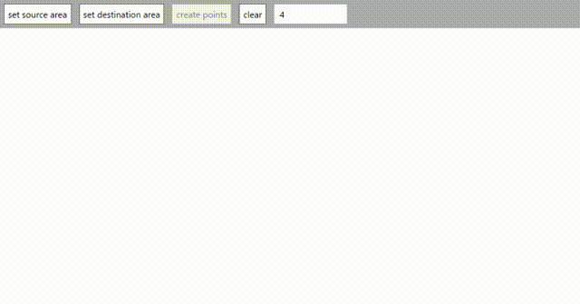

# HomographySharp
HomographySharp is a (C#/.NET Standard2.0 and .NET 5) class library for finding and using homography matrix.

# Install
NuGet: [HomographySharp](https://www.nuget.org/packages/HomographySharp/)

Package Manager
```
PM > Install-Package HomographySharp
```
.NET CLI
```
dotnet add package HomographySharp
```

# Usage
## Find homography matrix
```csharp
//System.Numerics.Vector2
var srcList = new List<Vector2>(4);
var dstList = new List<Vector2>(4);

srcList.Add(new Vector2(-152, 394));
srcList.Add(new Vector2(218, 521)); 
srcList.Add(new Vector2(223, -331));
srcList.Add(new Vector2(-163, -219));

dstList.Add(new Vector2(-666, 431));
dstList.Add(new Vector2(500, 300));
dstList.Add(new Vector2(480, -308));
dstList.Add(new Vector2(-580, -280));

// args type: ReadOnlySpan, IReadOnlyList, T[]
HomographyMatrix<float> homo = Homography.Find(srcList, dstList);

Point2<float> result = homo.Translate(-152, 394);

Assert.IsTrue(Math.Abs(result.X - -666) < 0.001); //true
Assert.IsTrue(Math.Abs(result.Y - 431) < 0.001);  //true

// System.Drawing.PointF
PointF pointf = result.ToPointF();
// System.Numerics.Vector2
Vector2 vector2 = result.ToVector2();
// MathNet.Numerics.LinearAlgebra.Matrix<T>
Matrix<float> mat = homo.ToMathNetMatrix();
```
or
```csharp
//HomographySharp.Point2<T>
var srcArray = new Point2<double>[4]; // or Point2<float>
var dstArray = new Point2<double>[4];

srcArray[0] = new Point2<double>(10, 10);
srcArray[1] = new Point2<double>(100, 10);
srcArray[2] = new Point2<double>(100, 150);
srcArray[3] = new Point2<double>(10, 150);

dstArray[0] = new Point2<double>(11, 11);
dstArray[1] = new Point2<double>(500, 11);
dstArray[2] = new Point2<double>(500, 200);
dstArray[3] = new Point2<double>(11, 200);

HomographyMatrix<double> homo = Homography.Find(srcList.AsSpan(), dstList.AsSpan());

Point2<double> result = homo.Translate(100, 10);

Assert.IsTrue(Math.Abs(result.X - 500) < 0.001); //true
Assert.IsTrue(Math.Abs(result.Y - 11) < 0.001);  //true
```

## Json serialize support
```cs
using System.Text.Json;

var homoMat = Homography.Find(srcList, dstList);

string json = JsonSerializer.Serialize(homo);

var homoMat2 = JsonSerializer.Deserialize<HomographyMatrix<double>>(json);
```

## Create homography matrix from raw array
```cs
HomographyMatrix<double> homoMat = ...;

var newMat = Homography.Create(homoMat.ElementsAsSpan());
```

# Visualize App
If you want to see how points are transformed by homography matrix, use this app.  
https://github.com/nenoNaninu/HomographySharp/tree/master/HomographyVisualizer




# Dependent Library 
- [Math.NET Numerics](https://github.com/mathnet/mathnet-numerics)
  - Copyright (c) 2002-2018 Math.NET  
  - Released under the [Math.NET Numerics License(MIT/X11)](https://github.com/mathnet/mathnet-numerics/blob/master/LICENSE.md)
